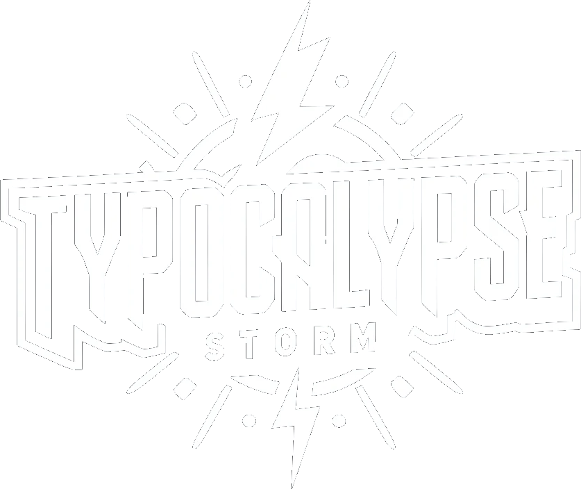

# Typocalypse Storm

A visually engaging typing practice app built with React, PIXI.js, and GSAP. As you type, enjoy dynamic particle effects, animated lightning, and immersive sound feedback for each keystroke. Great for fun, practice, or as a creative code demo!

## Features
- **PIXI.js Visual Effects**: Exploding particles, cinder trails, and animated lightning bolts for each typed character.
- **Sound Feedback**: Unique sounds for correct keys, backspace, errors, and space (lightning bolt).
- **Animated Cursor & Screen Shake**: The cursor follows your typing, and the screen shakes on correct input.
- **Sample Texts**: Randomly selected from a diverse set of sample passages.
- **Responsive Design**: Works on desktop browsers.
- **Offline Support**: No internet needed after download.

## Demo

## Getting Started

1. **Install dependencies**:
   ```bash
   pnpm install
   # or
   npm install
   # or
   yarn install
   ```

2. **Run the development server**:
   ```bash
   pnpm dev
   # or
   npm run dev
   # or
   yarn dev
   ```

3. Open [http://localhost:5173](http://localhost:5173) in your browser.